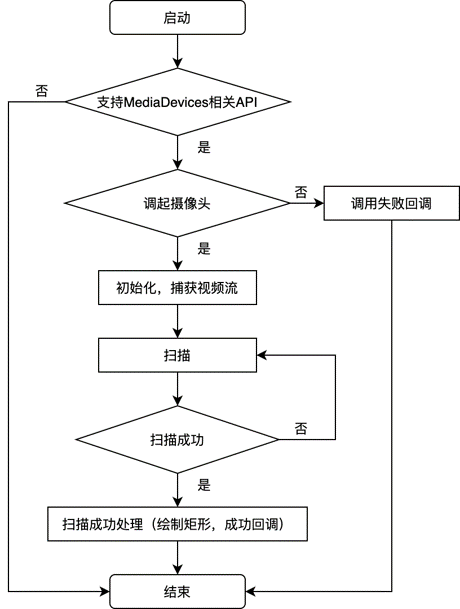

# 原生实现H5扫一扫二维码识别

#### 引用
+ [h5-scan-qrcode](https://github.com/dragonir/h5-scan-qrcode)

#### 流程
1. 调用navigator.mediaDevices.getUserMedia获取到视频流
2. 将视频流放到video进行播放，播放时通过canvas实时进行画布渲染，就能拿到图片
3. 将图片给到jsQR进行二维码识别



#### 技术详解
##### WebRTC API 
基于[WebRTC](https://developer.mozilla.org/zh-CN/docs/Web/API/MediaDevices/getUserMedia)提供的JS API可以获取到视频/音频流/屏幕共享等，核心API：
***navigator.mediaDevices.getUserMedia***

```js
//调用API每次都会提示用户给予使用媒体输入的许可，而且这个提示还不能改
navigator.mediaDevices.getUserMedia(constraints)
.then(function(stream) {
    // 这个stream就是数据流
  /* 使用这个 stream stream */
})
.catch(function(err) {
  /* 处理 error */
})
```

##### WebRTC adapter
使调用WebRTC接口的兼容性更高

##### jsQR 
[jsQR](https://github.com/cozmo/jsQR) 是一个纯 JavaScript 二维码解析库，该库读取原始图像，并将定位，提取和解析其中的任何 QR码。
如果要使用 jsQR 扫描网络摄像头流，则需要 ImageData 从视频流中提取，然后可以将其传递给 jsQR。 jsQR 导出一个方法，该方法接受 4 个参数，分别是解码的 图像数据，宽、高 以及 可选的对象 进一步配置扫描行为。
imageData：格式为 [r0, g0, b0, a0, r1, g1, b1, a1, …] 的 Uint8ClampedArray（ 8位无符号整型固定数组） 的 rgba 像素值。
```js
const code = jsQR(imageData, width, height, options);
if (code) {
  console.log('找到二维码！', code);
}
```

##### requestAnimationFrame
window.requestAnimationFrame() 告诉浏览器——你希望执行一个动画，并且要求浏览器在下次重绘之前调用指定的回调函数更新动画。该方法需要传入一个回调函数作为参数，该回调函数会在浏览器下一次重绘之前执行.

> window.requestAnimationFrame(callback);


